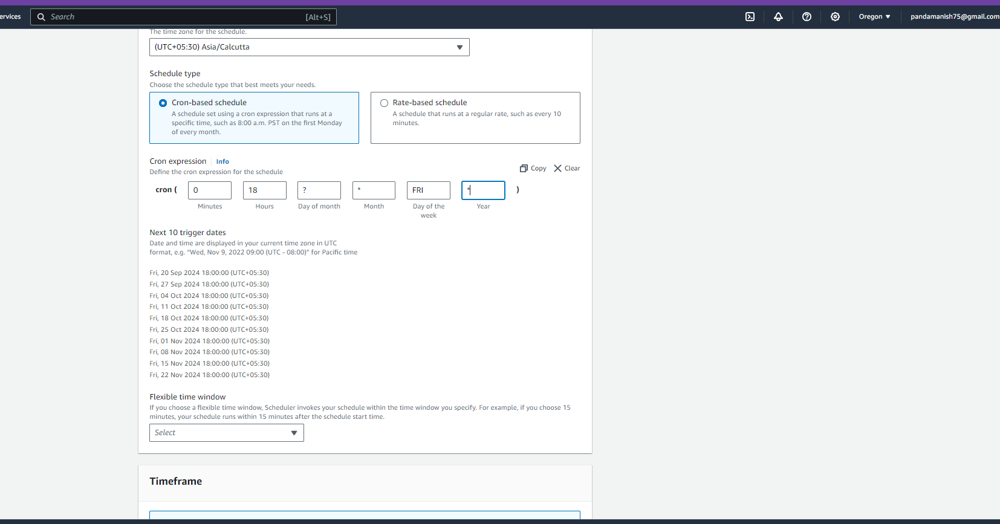
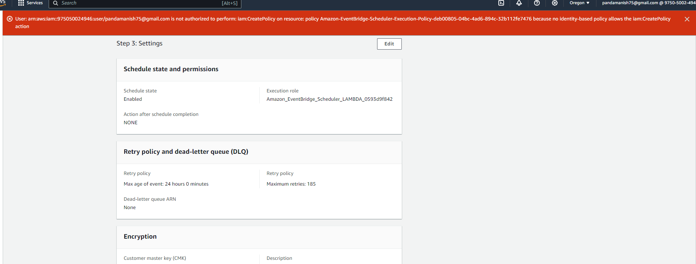
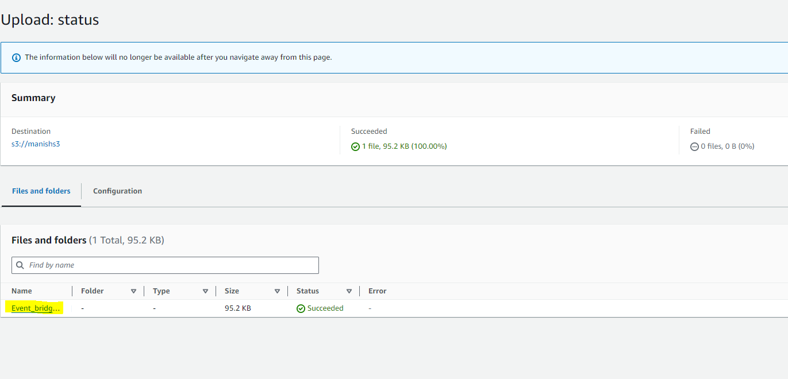
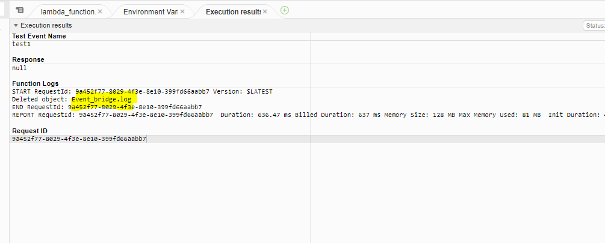

# Log Cleaner for S3 Bucket

# Overview
This project demonstrates how to implement an automated log cleaner for S3 buckets using AWS Lambda and Boto3. 
The function automatically deletes log files from a specified S3 bucket that are older than 90 days. 
The Lambda function is scheduled to run weekly using AWS EventBridge, ensuring that log files are regularly cleaned up and storage costs are minimized.

# Objective
The primary goal is to create a Lambda function that performs the following tasks:

Access a specified S3 bucket.
List all objects (log files) in the bucket.
Check the age of each log file.
Delete log files that are older than 90 days.

# Prerequisites
An active AWS account.
Familiarity with AWS services such as S3, Lambda, and IAM.
Access to AWS Management Console.
Basic knowledge of Python and Boto3.

# Steps
1. Created a New Lambda Function
Navigated to the AWS Lambda Console:

Open the AWS Lambda dashboard.

Created a New Lambda Function:
Clicked on Create Function.
Choose Author from scratch.
Entered a function name (manishs3lambda).
Selected Python 3.12 as the runtime.
Under Permissions, choosen existing role with basic Lambda permissions.
Click Create function.

2. Writen Lambda Function Code
The function will:

  Access the specified S3 bucket.
  List all log files in the bucket.
  Check if each log file is older than 90 days.
  Delete log files older than 90 days.

3.Added S3/manishs3 bucket as trigger for lambda. 

4. Scheduled the Function Using AWS EventBridge
Opened the AWS EventBridge Console:

Navigate to the EventBridge dashboard.
Create a New Rule:

Click Create Rule.
Named the rule.
Choosen Event Source as Schedule.
Set the schedule expression to rate for weekly FRI runs.
Added Target:

Under Targets, clicked Add target.
Choosen Lambda function and selected our newly created Lambda function.
Clicked Create to save the rule.

But had authorization issue so couldn't make it.

5. Tested the Lambda Function
Uploaded test log files to your S3 bucket, ensuring some files are older than 90 days.
Manually invoked the Lambda function from the AWS Lambda console to test if the function correctly identifies and deletes older files.
Just to check if the code was working fine we tweeked the code and changes the timedelta to 5min , as whichever files before 5min will be deleted.

# Verify the Results
Checked the contents of the S3 bucket after the function execution.
Ensured that log files older than 90 days have been deleted.
Reviewed the Lambda logs in CloudWatch to confirm successful execution and file deletions.
