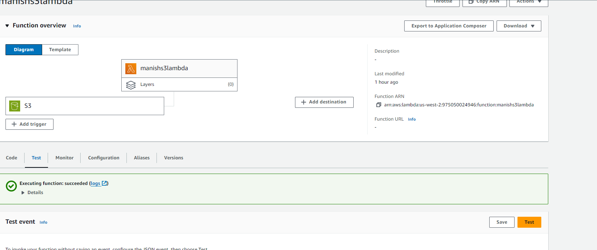
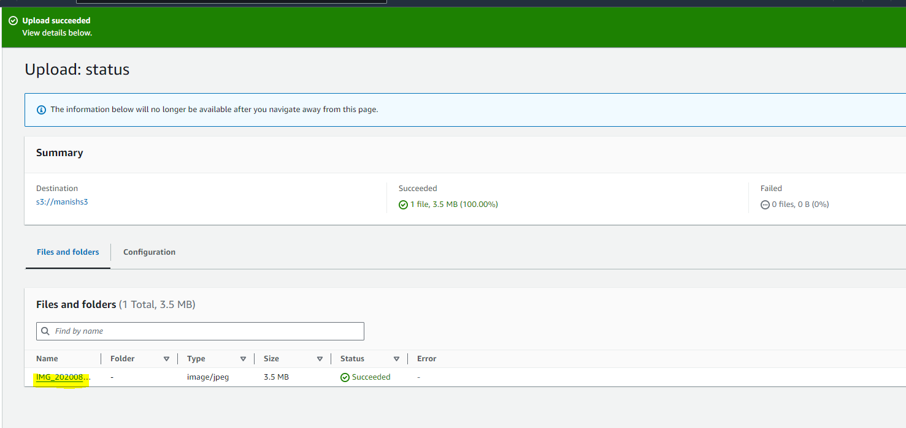
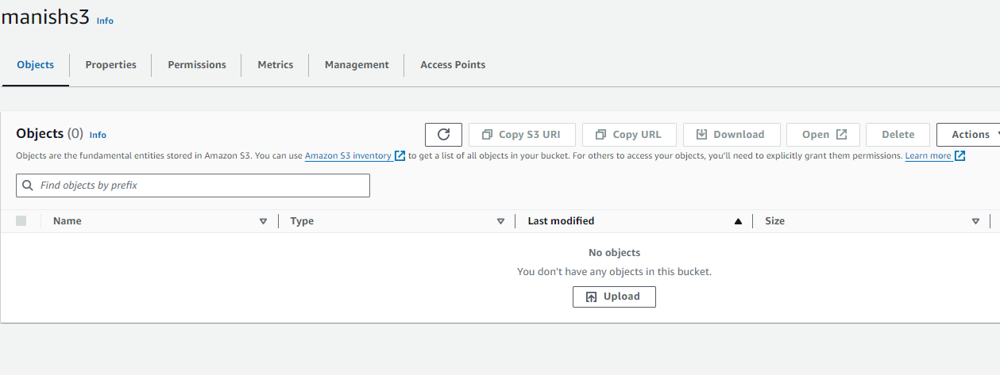

# Automated S3 Bucket Cleanup Using AWS Lambda and Boto3

# Overview
This project demonstrates how to automate the cleanup of old files in an S3 bucket using AWS Lambda and Boto3. The Lambda function automatically deletes files older than 30 days from a specified S3 bucket.

# Objective
The primary goal is to create a Lambda function that:

Listed all objects in a specified S3 bucket.
Identified objects older than 30 days.
Deleted identified objects.
Logs the names of deleted objects for monitoring purposes.

# Prerequisites
An active AWS account.
Familiarity with AWS services such as S3, Lambda, and IAM.
Access to the AWS Management Console.
Basic knowledge of Python and Boto3.

# Steps
1. S3 Setup
Navigated to the AWS S3 Dashboard.
Created a new S3 bucket.
Uploaded files to the bucket, ensuring that some files are older than 30 days.
2. Created Lambda Function
Navigated to the Lambda Console.
Clicked Create Function.
Selected Author from scratch.
Choose Python 3.12 as the runtime.
Assigned the existing IAM role.
Writen the Python code using Boto3 to delete files older than 30 days from the specified S3 bucket.
4. Lambda Function Code
Used the following Python code for your Lambda function:
5. Manual Invocation
Saved Lambda function.
Manually triggered the function by:
Navigating to the Lambda console.
Creating a test event.
Running the function.

7. Verify Results
After the Lambda function ran, checked the S3 bucket in the AWS S3 Dashboard.
Confirmed that files older than 30 days have been deleted and only newer files remain.
As of now just for testing , we set the time older file than 1hr.

