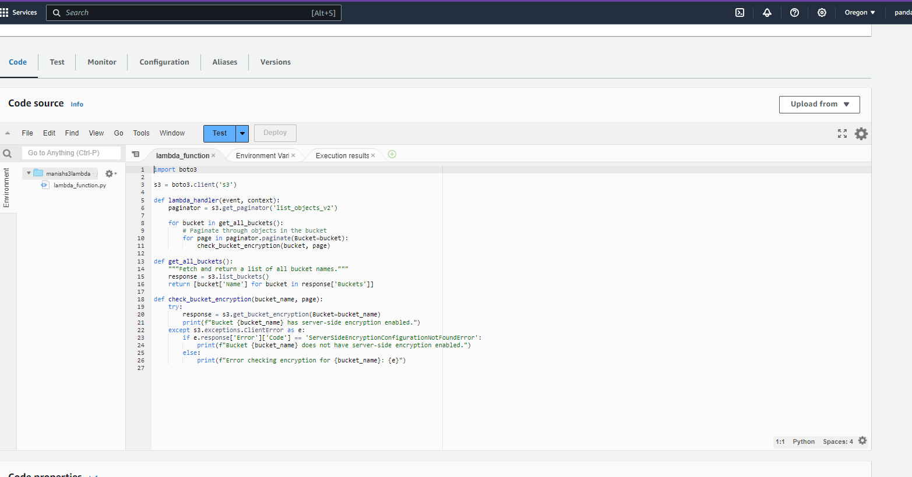
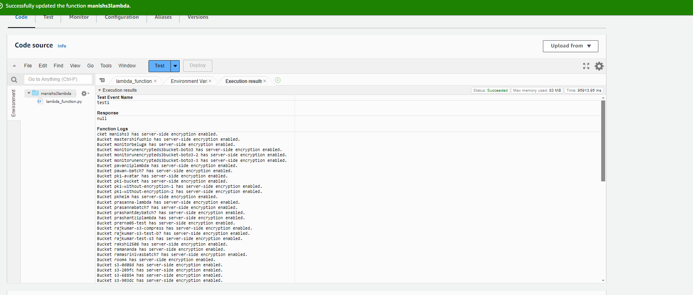

# Monitor Unencrypted S3 Buckets Using AWS Lambda and Boto3
# Overview
This project demonstrates how to automate the detection of unencrypted S3 buckets using AWS Lambda and Boto3. The Lambda function will check all S3 buckets in the account and log the names of those without server-side encryption enabled. This enhances your security posture by ensuring all buckets are protected.

#Objective
The primary goal is to create a Lambda function that:

Listed all S3 buckets in account.
Checked if each bucket has server-side encryption enabled.
Logs the names of unencrypted buckets for monitoring purposes.

# Prerequisites
An active AWS account.
Familiarity with AWS services such as S3, Lambda, and IAM.
Access to the AWS Management Console.
Basic knowledge of Python and Boto3.

# Steps
1. S3 Setup
Navigate to the S3 Dashboard in the AWS Management Console.
Create a few S3 buckets.
Ensured that a couple of the buckets do not have server-side encryption enabled to simulate potential security risks.
2. Create a Lambda Function
Go to the AWS Lambda Console.
Click Create function.
Choose Author from scratch:
Entered a function name(manishs3lambda)
Select Python 3.12 as the runtime.
Assign the existing IAM role earlier.
Click Create function.
3. Lambda Function Code
Boto3 Python script to monitor unencrypted S3 buckets

5. Manual Invocation and Testing
Saved the Lambda function code.

Manually triggerd the Lambda function:
In the Lambda console, created a test event and invoke the function.
didn't need to pass any specific input; the function automatically checks all buckets.

# Verifed the Results:
Opened Logs and review the logs.
Checked if the names of buckets without server-side encryption are listed.

